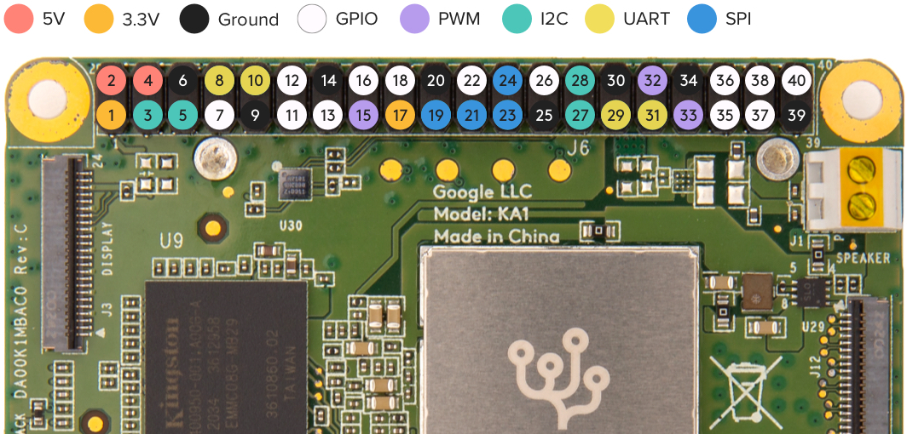

# Automated Cognifly landing with a Coral Board

Land a Cognifly automatically using AprilTag detection or object detection on the Edge TPU

## Setup the Coral Dev Board Mini

To start interacting with the Coral Dev Board Mini, follow Coral's instructions to [get started](https://coral.ai/docs/dev-board-mini/get-started/#2-install-mdt) and install MDT (Mendel Development Tool) if you haven't already.

Make sure you go through each step of the "Get started" guide to understand the differences between the two usb ports, to be able to SSH into the board with MDT and to update the Mendel software to its latest version. 

If you're having trouble connecting to the board with MDT, make sure you're connected through the data (OTG) port and that your cable supports data transfer. It is also possible that another computer was connected to the board before, which means there would already be a key registered on it. If this might be the case, you can follow this guide to [connect to a board from multiple computers](https://coral.ai/docs/dev-board/mdt/#connect-to-a-board-from-multiple-computers).

### Attach the Coral and it's camera to the drone

To attach a Coral board instead of a Raspberry Pi Zero to a Cognifly, a new support must be printed for it and it's camera. You can find three stl files containing the three pieces you'll need in the [Coral_stl](Coral_stl) folder.

### Connections with the flight controller

The flight controller needs to be configured. If you haven't done it, follow the "Flight controller configuration" part of the [Drone setup](https://github.com/thecognifly/cognifly-python/blob/main/readme/DRONE_SETUP.md) guide on cognifly-python's repository.

Now, the flight controller can be connected to the Coral. Here's a picture of the pins layout from Coral's [documentation on the I/O pins](https://coral.ai/docs/dev-board-mini/gpio/#header-pinout) for reference.



- 5V and ground: The pins 2 or 4 can be used for 5V and any ground pin will do for the ground connection. 
- Serial communication: The pins 29 and 31 (Tx and Rx respectively) must be used. If you use 8 and 10, you'll get some conflicts with the serial console inside Mendel linux that uses the ttyS0 port. The pins 29 and 31 use the ttyS1 port. They're safe to use. 

If you also need to use the ttyS0 port, you can disable the serial console with the following commands : 

```bash
sudo systemctl stop serial-getty@ttyS0.service
sudo systemctl disable serial-getty@ttyS0.service
```

Beware though. If you lose the ability to connect to the Coral through SSH, like in the event where the system gets corrupted, you won't be able to use the serial console as a last resort for connection. You'll be forced to flash the board. Also, disabling this service does not prevent the bootloader of Mendel linux from sending data through ttyS0 during boot, which used to trigger the DFU mode on the flight controller.

The next steps are done in a python virtual environment to ensure there is no dependency conflicts.

### Install cognifly-python

The [cognifly-python](https://github.com/thecognifly/cognifly-python) library now supports the Coral Dev Board Mini. You can easily install it from source by pulling the code and then running the following commands :

```bash
cd cognifly-python
pip3 install --upgrade pip
pip3 install .
```

You should now be able to run cognifly-controller like mentionned in the cognifly-python documentation. If access to the serial port is denied, add the user to the dialout group and then reboot :

```bash
sudo usermod -aG dialout ${USER}
sudo reboot now
```

### Add the cognifly service

A linux service that launches cognifly-controller on boot needs to be added in order to add autonomous control. To do so, follow these steps :

- Go to /etc/systemd/system and add the cognifly.service file:
```bash
cd /etc/systemd/system
sudo touch cognifly.service
```
- Write the service inside cognifly.service. This considers that cognifly-python is installed in a virtual environment. Change venv_name for the name of your virtual environment:
```
[Unit]
Description=Activates the cognifly-python controller
After=network-online.target

[Service]
ExecStart=/bin/bash -c "source /home/mendel/<venv_name>/bin/activate ; cognifly-controller headless"
RestartSec=10
Restart=on-failure

[Install]
WantedBy=multi-user.target
```
- Reload the daemons so the system can see the modifications and enable the service for it to start on boot :
```bash
sudo systemctl daemon-reload
sudo systemctl enable cognifly.service
```
- Reboot or start the service with :
```bash
sudo systemctl start cognifly.service
```

When everything is configured properly, you can see the system logs of cognifly.service with ```journalctl -u cognifly.service```

### Develop on the Coral with VS Code

To have a much more enjoyable experience when developing on the Coral Dev Board Mini, you can establish an ssh connection to it through VS Code. You can follow the [Remote development over SSH](https://code.visualstudio.com/docs/remote/ssh-tutorial) guide, or you can simply try installing the Remote - SSH extension on VS Code, then selecting the Remote Explorer icon on the activity bar on the left. You can then add select "Add New" which is the little plus icon and you'll be asked to enter an SSH connection command. The command should look like this :

```bash
ssh mendel@<ip_address>
```
You can find the IP address of your Coral device when you connect to it with ```mdt shell```. The address will be at the end of the second printed line. When you try to connect to the Coral through Remote - SSH for the first time, make sure it's connected to the internet, because a few installations will be done. When this is done, you'll should be able to reconnect to it by going back to Remote Explorer and to select the right host for connection.

## Run inference on the Edge TPU

For this, you will need a TensorFlow lite model compiled for the Edge TPU with the compiler provided by Coral. You can find more details about what is needed to have a compatible model [here](https://coral.ai/docs/edgetpu/models-intro/). Coral provides some [trained TensorFlow models](https://coral.ai/models) that work out of the box on the Edge TPU. 

To run an inference with the chosen model, you can of course use the TensorFlow lite API, but Coral provides the [Pycoral](https://coral.ai/docs/reference/py/) library to simplify the code. One drawback with Pycoral is that it expects your model to correspond to a certain format like to have a certain number of inputs or outputs. If your model doesn't comply, you'll need to use the TensorFlow lite API directly. 

### AIYmakerkit for a quick setup

[AIYmakerkit](https://aiyprojects.withgoogle.com/maker/#reference) is a library that uses Pycoral to run inferences specifically on the Edge TPU. For people how are completely new to machine learning, AIYmakerkit helps a lot to have an application doing inference that is up and running quickly. Because it is built with Pycoral, it still has the issue where the model needs to be in a certain format.

Follow these steps to install it:

- Install pycoral >= 2.0.0 :
```bash
python3 -m pip install --extra-index-url https://google-coral.github.io/py-repo/ pycoral~=2.0
```
- If you get "fatal error: portaudio.h: No such file or directory", install portaudio :
```bash
sudo apt install portaudio19-dev
```
- Install aiy-maker-kit :
```bash
git clone https://github.com/google-coral/aiy-maker-kit.git
cd aiy-maker-kit
pip3 install .
```

The scripts object_detect.py and flying_object_detect.py use AIYmakerkit to start an inference and get it's output to guide the drone towards desired object. You can provide it with a different model, but it will need to be in the right format. These scripts do object detection, but AIYmakerkit can be used for many different types of models.

### Object detection

object_detect.py can be used to see the detections of the model. You'll need to have a display connected to the Coral Dev Board Mini. You can run it with this command :

```bash
python3 Object_detection/object_detect.py
```

If you get an error like "qt.qpa.xcb: could not connect to display", you can solve the issue with this command that can be added to the .bashrc file to prevent it from happening again:

```bash
export DISPLAY=:0.0
```

flying_object_detect.py contains a script that controls the approach of the drone to a certain object. you can run it with :

```bash
python3 Object_detection/flying_object_detect.py
```
Be aware that, with the current state of the script, you'll need to have a separate program to stop the Cognifly before it's automated landing ends. To abort, you can simply interrupt (ctrl+C) and then start another script that simply send a land and a disarm command.

Feel free to modify both files to test your own models, detect different objects from [coco_labels.txt](Object_detection/coco_labels.txt) or tune the parameters for the object approach like the PIDs gains, the frames width and height or the drone hostname. A new implementation using directly the TensorFlow lite API would be interesting to enable the use of a wider variety of models.

## Run AprilTag detection

### Calibration

To run proper tag detection, you'll first need to get the parameters of your camera by doing some calibration. In order to do this, take a few pictures of a [calibration board](AprilTag_detection/Calibration-Board.png) with the camera you'll be using at different angles and distances. Between 25 and 30 pictures should be enough. When you have the pictures, provide them to the [calibration script](AprilTag_detection/calibrate_camera.py) with the right options for your calibration board. If you used the image provided in the AprilTag_detection folder, the following command will start calibration :

```bash
python3 AprilTag_detection/calibrate_camera.py <path to each image separated by spaces> -r 7 -c 9 -s <chessboard square size>
```

If another chessboard was used, see the calibration script for details on the arguments.

### Generate AprilTags

Before trying the detection, you'll have to print AprilTags. There are pregenerated tags in the [apriltag-imgs](https://github.com/AprilRobotics/apriltag-imgs) repository from [AprilRobotics](https://github.com/AprilRobotics). You can also generate your own ones by following the guide in [apriltag-generation](https://github.com/AprilRobotics/apriltag-generation). Currently, the tags used in [flying_tag_detect.py](AprilTag_detection/flying_tag_detect.py) and [tag_detect.py](AprilTag_detection/tag_detect.py) are from the tag25h9 family, but it can easily be changed.

### Install the AprilTag detection library

For the AprilTag detection, the library used is called [duckietown](https://github.com/duckietown/lib-dt-apriltags). You can install it with this command :

```bash
pip3 install dt-apriltags
```

### Detection

You can now run one of the two AprilTag detection scripts. Use [tag_detect.py](AprilTag_detection/tag_detect.py) to see the detections on a screen. The Coral Dev Board Mini must be plugged into a display to use it. Run it with this command :

```bash
python3 AprilTag_detection/tag_detect.py
```

[flying_tag_detect.py](AprilTag_detection/flying_tag_detect.py) can be used for an automated approach of an AprilTag that is stuck on the base station and for landing on the station. The drone may not land properly on the station everytime because of the way it currently needs to land, which is almost by throwing itself. In that case, the landing sequence can be tuned in the script. You can launch it with the command :

```bash
python3 AprilTag_detection/flying_tag_detect.py
```
Like for the [object detection](#object-detection) approach, you'll need another script to stop the Cognifly before it's automated landing.

The reason the drone has to land this way is the time-of-flight sensor that gets the actual height of the drone for the control loop on the flight controller. When it goes above the base station, the detected height suddenly lowers. That causes the drone to increase it's altitude to restore the height it's supposed to be at. One way to completely get rid of the problem would be to modify the firmware on the flight controller to use a different position estimator, but this is far from being a straight forward solution.

## Control the Cognifly with a bluetooth PS4 controller

If you want to try to control the Cognifly manually, you can follow the [steps to connect a PS4 controller](https://github.com/thecognifly/cognifly-python#manual-control). Last time it was tried, the controller did not connect properly to the Coral, so it was impossible to control the drone. Everytime it was tried, the following error always raised when running the connect command :

```bash
Failed to connect: org.bluez.Error.Failed
```

This will need further troubleshooting in order to make it work.